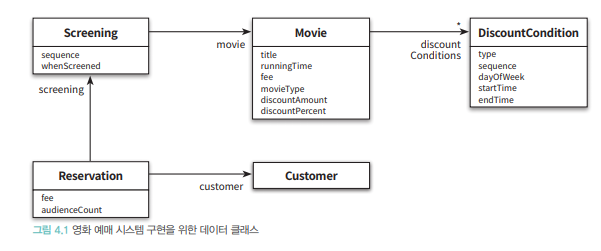
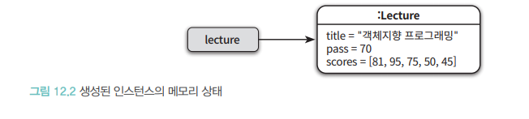
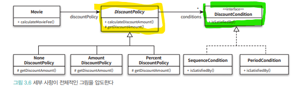
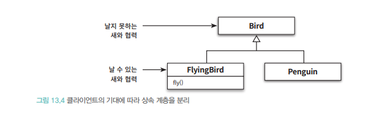
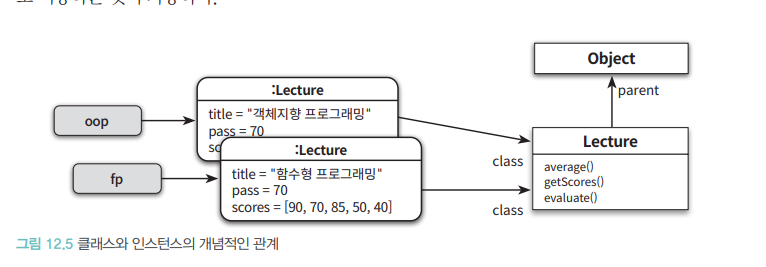
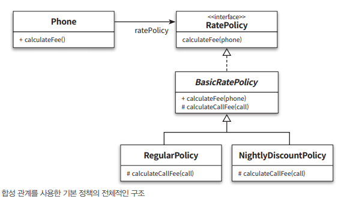
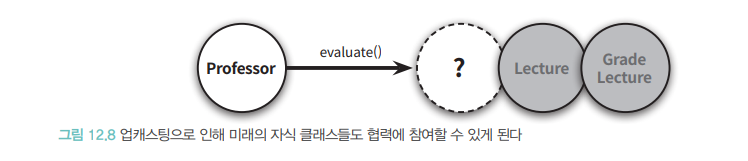
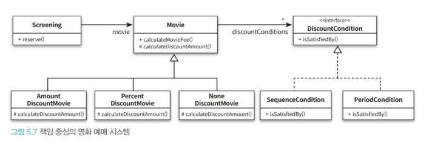
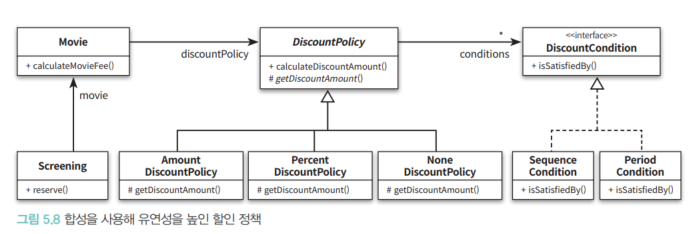

# 5. 책임 할당하기

데이터 중심 설계는 `행동보다 데이터`를 먼저 결정하고, 협력이라는 문맥을 벗어나 `고립된 객체에 초점` 결과적으로 `캡슐화 위반`, `높은 결합도`,
`코드변경 취약`의 결과를 가져온다.

하지만 책임 중심의 설께는 `어떤 객체에게 어떤 책임을 할당하는 과정 (트레이드 오프)` 가 어렵다.
GRASP 패턴을 통해 책임할당의 어려움에 답을 찾아보기

## 5-1. 책임주도 설계를 향해
- 데이터보다 행동을 결정하기
- 협력이라는 문맥 안에서 책임 결정

### 데이터보다 행동 결정하기
- 객체에게 중요한건 `외부에 제공하는 행동` 즉 `객체의 책임`을 의미함, 협력안에서 수행하는 책임이 객체의 존재를 증명
- 항상 객체가 수행하는 책임에 집중해 설계해야함

### 협력이라는 문맥안에서 책임 결정
- 책임의 품질은 협력의 적합함으로 판단
- 적합한 책임은 메시지 전송자에게 적합한 책임을 의미
- 메시지가 존재하기에 메시지를 처리할 객체가 존재함 → 메시지를 먼저 결정하면 수신자에 어떠한 가정도 불가함 → 자연스러운 캡슐화

## 5-2. 책임할당을 위한 GRASP 패턴
객체에게 책임을 할당할 때 지침으로 삼을 수 있는 원칙

### 도메인 개념에서 출발하기
- 책임을 할당할 때 가장 유럭한 후보는 바로 도메인 개념

- `설계의 시작 단계는 개념과 의미를 완전히 알 필요가 없다.`
- 빠르게 설께와 구현을 진행

### 정보 전문가에게 책임 할당
메시지를 전송할 객체의 의도를 반영하기
1. 메시지를 전송할 객체가 원하는 것 **( 예매 하기 )**
2. 메시지를 수신할 객체 **( 수행할 정보를 알고있는 객체에게 책임을 할당 )**

※`정보 전문가 패턴` : 객체가 자신이 소유하고 있는 정보와 관련된 작업을 수행한다는 일반적인 직관

3. 정보전문가 패턴은 예매 정보를 가장 많이알고있는 객체에게 예매하라를 할당 **(Screening)**

4. Screening 객체에서 메시지를 처리하기 위한 절차와 구현을 고민 **(세세하게 고민하지 않기)**
   4. 스스로 처리할 수 없다면 외부에 도움을 요청
   5. **예약하라** 가 완료되기 위해선 가격, 인원정보, 할인정보가 필요함
   6. `가격을 계한하라` 라는 결론 도출
   

5. Movie 객체에서 해야하는 작업 고민
   5. 할인 가능여부 판단 후 금액 계산
   6. 관련되어 **외부에 도움 요청**
   7. 할인에 대한 정보 전문가는 `DiscountCondition`



### 높은 응집도와 낮은 결합도
설계는 `트레이드 오프 활동` 정보전문가 패턴 이외에도 다양한 경우의 수를 고려한 설계 선택이 필요함


Screening이 DiscountCondition 과 직접 협력하지 않은 이유는 `응집도와 결합도`에 원인이 있음
다양한 대안들이 존재한다면 응집도/결합도 측면에서 더 나은 대안을 선택해야함 → ` LOW COHESION /LOW COUPLING PATTERN`

#### LOW COUPLING
Screening이 DiscountCondition과 직접 협력하면 결합도가 하나 증가하게 된다. `LOW COUPLING` 관점에서는 Movie 와 협력하는것이
더 적절한 대안이 됨

#### LOW COHESION
Screening 은 **영화를 예매 생성하는 책임**,  DiscountCondition과 협력하면 계산책임일부를 가져와야함
계산하는 방식이 바뀌면 Screening도 바뀌게됨

Movie의 주된 책임은 **영화를 계산하는 일**, Screening과 협업해도 응집도측면에서 좋음

### 창조자에게 객체 생성 책임 할당
예매 시스템의 최종 결과물 : **Reservation** 인스턴스 생성, GRASP의 `CREATOR PATTERN` 경우 사용할 수 있는 책임 할당 패턴,
생성할 책임을 어떤 객체에게 할당할지 지침을 제공

※`CREATOR PATTERN`:  생성되는 객체와 연결되거나 관련될 필요가 있는 객체에 해당 객체를 생성할 책임을 맡김
1. Reservation 을 잘알고 사용하는 객체는 Screening, Screening을 Reservation 의 **CREATOR** 로 선택하는게 적절함


## 구현을 통한 검증
```java 
class Screening { 
...
public Reservation reserve(Customer customer, int audienceCount) {
        return new Reservation(customer, this, calculateFee(audienceCount), audienceCount);
    }
...
}
```
협력의 관점에서 Screening 은 예매하라 메시지에 응답할 수 있어야함 → 메시지를 처리할 메서드를 구현함

```java
{
...
private Movie movie;
private int sequence;
private LocalDateTime whenScreened;
...
}

```
책임이 결저오디어 수행하는데 필요한 인스턴스 변수를 결정

```java
private Money calculateFee(int audienceCount) {
        return movie.calculateMovieFee(this).times(audienceCount);
}
```
Movie에 전송하는 메시지는 송신자인 Screening 의 의도를 파악 `(Screening이 내부 구현에 대한 어떤 지식도 없이 전송할 메시지 결정)`

```java
class Movie {

    private String title;
    private Duration runningTime;
    private Money fee;
    private DiscountPolicy discountPolicy;

    public Money calculateMovieFee(Screening screening) {
        //~
    }
}
```

Movie는 메시지에 응답하기위해 `calculateMovieFee` 메서드와 필요한 필드를 구현함, Movie는 DiscountCondition에 할인 여부를 판단하는 메시지를 전송함

```java
public class DiscountCondition {
    boolean isSatisfiedBy(Screening screening);
}
```
isSatisfiedBy 메서드는 type의 값에 따라 적절한 메서드를 호출해줌
그리고 조건을 판단하기 위해 Screening의 정보를 가져옴


### DiscountCondition 개선하기
```java
public boolean isSatisfiedBy(Screening screening) {
        if (type == DiscountConditionType.PERIOD) {
            return isSatisfiedByPeriod(screening);
        }

        return isSatisfiedBySequence(screening);
}

private boolean isSatisfiedByPeriod(Screening screening) {
        return screening.getWhenScreened().getDayOfWeek().equals(dayOfWeek) &&
                startTime.compareTo(screening.getWhenScreened().toLocalTime()) <= 0 &&
                endTime.compareTo(screening.getWhenScreened().toLocalTime()) >= 0;
}
    
```

위 두개의 함수는 서로 다른 이유로 변경됨, 순번 조건에 대한 요구사항이 달라지거나, 기간조건이 다라지면 구현이 변경되는 이슈가 있음
설계는 어렵지만 문제를 찾는 패턴들이 존재함

**인스턴스 변수가 초기화되는 시점 보기** : 응집도가 높은 클래스는 인스턴스를 생성할때 모든 속성을 함께 초기화

**메서드들이 인스턴스 변수를 사용하는 방식** :메서드가 객체의 모든 속성을 사용하면 응집도는 높음

- DiscountCondition 의 isSatisfiedBySequence 와 Period 메서드는 sequence는 사용하지만 시간 관련은 사용하지 않음,
- 반대로 Period 에서는 시간관련 필드는 사용하지만 sequence 관련 필드는 사용하지 않음

### 타입 분리하기
DiscountCondition 의 큰 문제는 두개의 독립적인 타입이 하나의 클래스 안에 공존함 클래스를 분리하면
동일한 인스턴스로 코드품질을 높이는데 성공 했지만, **새로운 문제가 발생함**

Movie 와 협력하는 DiscountCondition은 하나였지만 Class 분기가 일어나면 `결합도가 2개`로 늘어남

### 다형성 통해 분리하기
Movie 의 입장에서 Sequence와 Period는 동일한 책임을 수행 → 동일한 역할을 수행, Moive 가 `구체적으로 클래스는 알지 못한 채 오직 역할에 대해서만
결합되도록 의존성을 제한`



```java
public interface DiscountCondition {
    boolean isSatisfiedBy(Screening screening);
}
```
인터페이스를 통해 이역할을 구현하고 인터페이스를통해 각각을 실체화 하면됨
```java
public class SequenceCondition implements DiscountCondition {
    private int sequence;

    public SequenceCondition(int sequence) {
        this.sequence = sequence;
    }

    public boolean isSatisfiedBy(Screening screening) {
        return screening.inSequence(sequence);
    }
}

...
```

Movie는 구체적인 타입을 몰라도 됨
```java
public Money calculateMovieFee(Screening screening) {
        return fee.minus(discountPolicy.calculateDiscountAmount(screening));
}
```
Movie가 전송한 메시지를 수산한 객체의 구체적 클래스가 무엇인가에 따라 적절한 메서드가 실행 → `다형성 패턴`

### 변경으로 부터 보호
Movie 에서는 DiscountPolicy의 구체적인 클래스를 알지 못함, DiscountPolicy의 구체적인 클래스를 알지 못하면서도
`계속해서 확장`가능해짐 → `PROTECTED VARIATIONS PATTERN`

### Movie 개선
금액할인 정책 영화와 비율 할인 정책 영화라는 두가지 타입을 하나의 클래스에서 구현함
`POLYMORPHISM PATTERN` 을 통해 서로 다른 행동을 타입별로 분리해서 다형성 혜택을 누림

```java
public class Movie {
import java.time.Duration;
import java.util.Arrays;
import java.util.List;

   public abstract class Movie {
      private String title;
      private Duration runningTime;
      private Money fee;
      private List<DiscountCondition> discountConditions;


      public Movie(String title, Duration runningTime, Money fee, DiscountCondition... discountConditions) {
         this.title = title;
         this.runningTime = runningTime;
         this.fee = fee;
         this.discountConditions = Arrays.asList(discountConditions);
      }

      public boolean isDiscountable(Screening screening) {
         return discountConditions.stream()
                 .anyMatch(condition -> condition.isSatisfiedBy(screening));
      }

      public Money getFee() {
         return fee;
      }


      public Money calculateMovieFee(Screening screening) {
         if (isDiscountable(screening)) {
            return fee.minus(calculateDiscountAmount());
         }

         return fee;
      }

      abstract protected Money calculateDiscountAmount();
   }

```

```java
import java.time.Duration;

public class PercentDiscountMovie extends Movie {
    private double percent;

    public PercentDiscountMovie(String title, Duration runningTime, Money fee, double percent, DiscountCondition... discountConditions){
        super(title, runningTime, fee, discountConditions);
        this.percent = percent;
    }

    @Override
    protected Money calculateDiscountAmount() {
        return getFee().times(percent);
    }
}

```

할인 정책에 따라 Movie가 분리되어 모든 클래스의 내부는 캡슐화 되고 변경 이유를 오직 하나씩만 가져가게됨
클래스는 응집도가 높고 다른 클래스와 최대한 느슨하게 결합



### 변경과 유연성
`설계를 주도하는건 변경` 변경에 대비하기위해선
- 코드를 쉽게 단순 설계
- 코드를 수정하지 않고 변경을 수용할수 있도록 유연하게 만들기

전자도 좋지만 변경이 반복적으로 발생하면 유연성을 추가하는 두번째 방법이 좋음



유연성에대한 압박이 설계에 어떻게 영향을 주는지 잘 보여주게됨
유연성은 의존성관리의 문제이고 결합도를 조절할 수 있는 능력은 `객체 지향 개발자가 갖춰야 하는 기술중 하나`

