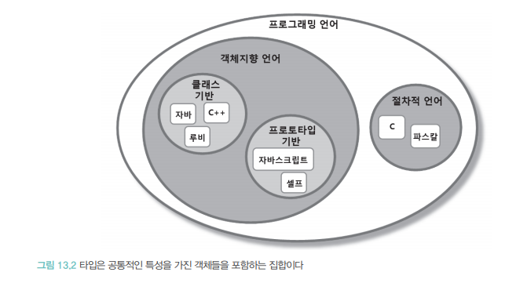
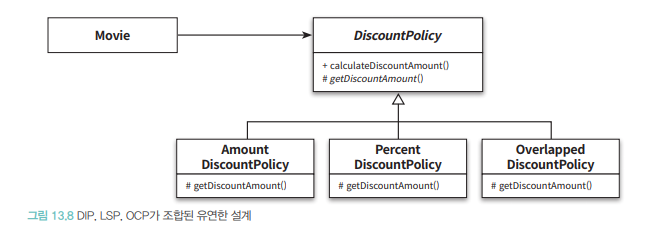

# 합성과 유연한 설계

- 합성은 전체를 표현하는 객체가 부분을 표현하는 객체를 포함해서 부분 객체의 코드를 재사용
- 두 객체 사이 의존성은 런타임에서 해결됨
- 상속의 관계는 `is-a` 관계, 합성의 관계는 `has-a` 관계
- 상속은 부모의 정의를 물려받으므로 재사용 가능해짐, 하지만 부모에대해 자세히 알아야하기 떄문에 자식 클래스와 부모클래스 결합도가 높아짐
- 결과적으로 상속은 코드를 재사용 할 수 있는 쉽고 간단한 방법이지만 우아한 방법은 아님

## 상속을 합성으로 변경하기
- 불필요한 인터페이스 상속 문제
  - 자식 클래스에게는 부적합한 부모 클래스의 오퍼레이션이 상속되어 자식 인스턴스 상태가 불안해지는 문제
- 메서드 오버라이딩 오작용
  - 자식 클래스가 부모 클래스의 메서드 오버라이딩 할때 자식 클래스가 부모 클래스의 메서드 호출방법에 영향을 받음
- 부모 클래스와 자식 클래스 동시수정 문제
  - 개념적인 결합으로 인해 부모 클래스를 변경할 때 자식 클래스도 함께 변경 해야하는 문제

### 불필요한 인터페이스 상속 문제
```java
public class Properties {
    private Map<String, String> properties = new HashMap<>();
    
    public String setProperty(String key, String value) {
        return properties.put(key, value);
    }
    
    public String getProperty(String key) {
        return properties.get(key);
    }
}
```

- `Hashtable`의 오퍼레이션이 더이상 인터페이스를 오염시키지 않음
- 클라이언트는 `Hashtable`의 오퍼레이션을 사용할수 없기때문에 규칙을 어길 가능성도 낮아짐

### 메서드 오버라이딩 오작용 문제: InstrumentedHashSet
```java
public class InstrumentedHashSet<E> {
    private int addCount = 0;
    private Set<E> set;
    
    public InstrumentedHashSet(Set<E> set) {
        this.set = set;
    }
    
    public int getAddCount() {
        return addCount;
    }
    
    public boolean add(E e) {
        addCount++;
        return set.add(e);
    }
    
    public boolean addAll(Collection<? extends E> c) {
        addCount += c.size();
        return set.addAll(c);
    }
}
```

- `Properties` 와 `Stack`을 합성으로 변경한 이유는 불필요한 오퍼레이션 들이 퍼블릭 인터페이스 스며드는것을 방지
- HashSet에 대한 구현 결합도를 제거하고 퍼블릭 인터페이스를 그대로 상속 받는 방법 → 인터페이스

```java
public class InstrumentedHasSet<E> implements Set<E> {
    private int addCount = 0;
    private Set<E> set;
    
    public InstrumentedHashSet(Set<E> set) {
        this.set = set;
    }
    
    public int getAddCount() {
        return addCount;
    }
    
    @Override
    public boolean add(E e) {
        addCount++;
        return set.add(e);
    }
    
    @Override
    public boolean addAll(Collection<? extends E> c) {
        addCount += c.size();
        return set.addAll(c);
    }
    
    
    @Override public int size() { return set.size(); }
    ...
}
```

- `InstrumentedHashSet`은 `Set` 오퍼레이션을 오버라이딩한 인스턴스 메서드 내부의 HashSet 인스턴스에게 동일 메서드 호출을 전달
- `포워딩`: 동일한 메서드를 호출하기 위해 추가된 메서드

### 부모 클래스와 자식 클래스의 동시 수정 문제: PersonalPlaylist
```java
public class PersonalPlaylist {
    private Playlist playlist = new Playlist();
    private Set<String> genreSet = new HashSet<>();
    
    public void appendSong(Song song) {
        playlist.appendSong(song);
        genreSet.add(song.getGenre());
    }
    
    public void removeSong(Song song) {
        playlist.removeSong(song);
        genreSet.remove(song.getGenre());
    }
}
```
- 합성으로 변경하더라도 가수별 노래 목록을 유지하기위해 `Playlist`와 `PersonalPlaylist`의 코드를 동시 수정해야함
- 상속보단 합성을 사용하는게 더좋음
- `Playlist` 내부 구현변경에 대한 파급효과를 `PersonalPlaylist` 내부로 캡슐화 가능

## 상속으로 인한 조합의 폭발적인 증가
- 상속으로 인해 결합도가 높아지면 코드를 수정하는데 필요한 작업양이 과도하게 늘어남
- 하나의 기능을 추가하거나 수정하기 위해 불필요하게 많은 수의 클래스를 추가하거나 수정해야함
- 단일 상속만 지원하는 언어에서는 상속으로 인해 종복 코드가 늘어남

### 기본 정책과 부가 정책 조합하기


- 기본 정책의 계산 결과에 적용함
  - 세금 정책은 기본 정책인 RegularPhone, NightlyDiscountPhone의 계산 결과에 적용
- 선택적으로 적용 가능
  - 기본 정책의 계산 결과에 세금 정책을 적용 할수도 안할수도있음
- 조합 가능
  - 기본 정책에 세금 정책만 적용하는것도 가능, 기본 요금 할인 정책만 적용하는것도 가능, 세금 정책과 기본요금 함께 적용도 가능
- 부가 정책은 임의의 순서로 적용 가능
  - 기본 정책에 세금 정책과 기본요금 할인정책을 함께 적용할 순서 둘다 적용가능



### 상속을 이용해 기본 정책구현

```java
public abstract class Phone {
    private List<Call> calls = new ArrayList<>();
    private double taxRate;
    private double discountAmount;
    
    public Phone(double taxRate, double discountAmount) {
        this.taxRate = taxRate;
        this.discountAmount = discountAmount;
    }
    
    public Money calculateFee() {
        Money result = Money.ZERO;
        for(Call call : calls) {
            result = result.plus(calculateCallFee(call));
        }
        return result.minus(result.times(taxRate));
    }
    
    abstract protected Money calculateCallFee(Call call);
}
```

### 기본 정책에 세금 정책 조합하기
- 일반요금제에 세금 정책을 조합하려면 RegularPhone 클래스를 상속받은 TaxableRegularPhone 클래스를 추가로 구현해야함

```java
public class TaxableRegularPhone extends RegularPhone {
    private double taxRate;
    
    public TaxableRegularPhone(Money amount, Duration seconds, double taxRate) {
        super(amount, seconds);
        this.taxRate = taxRate;
    }
    
    @Override
    protected Money afterCalculated(Money fee) {
        return fee.plus(fee.times(taxRate));
    }
}
```

- super를 사용하여 원하는 결과를 얻을수 있지만 자식 클래스와 부모 클래스 사이 결합도가 높아진다
- 자식 클래스가 부모 클래스의 구체적인 구현이 아니라 필요한 동작의 명세를 기술하는 추상화에 의존

```java
public abstract class Phone {
    private List<Call> calls = new ArrayList<>();
    
    public Money calculateFee() {
        Money result = Money.ZERO;
        for(Call call : calls) {
            result = result.plus(calculateCallFee(call));
        }
        return afterCalculated(result);
    }
    
    protected abstract Money afterCalculated(Money fee);
    protected abstract Money calculateCallFee(Call call);
}
```

- 자식 클래스는 afterCalculated 메서드를 오버라이딩해서 계산된 요금에 적용할 작업을 추가

```java
public class RegularPhone extends Phone {
    private Money amount;
    private Duration seconds;
    
    public RegularPhone(Money amount, Duration seconds) {
        this.amount = amount;
        this.seconds = seconds;
    }
    
    @Override
    protected Money afterCalculated(Money fee) {
        return fee;
    }
    
    @Override
    protected Money calculateCallFee(Call call) {
        return amount.times(call.getDuration().getSeconds() / seconds.getSeconds());
    }
}
```

- 부모 클래스에 추상 메서드를 추가하면 모든 자식 클래스들이 추상 메서드를 오버라이딩 해야함
- 자식클래스의 수가 많을 경우 꽤나 번거로운 일이됨
- 유연성은 유지하면서 중복코드를 제거할 수 있는 방법은 `Phone` 에서 `afterCalculated` 메서드에 대한 기본 구현을 함께 제공함
- `RegularPhone` 과 `NightlyDiscountPhone` 클래스에서는 `afterCaulated`메서드를 오버라이딩 할 필요가 없음

```java
public abstract class Phone {
    ...
    protected Money afterCalculated(Money fee) {
        return fee;
    }
    
    protected abstract Money calculateCallFee(Call call);
}
```

`TaxableRegularPhone` 을 수정할 차례임, 요금 계산 결과에 세금을 부과함

```java
public class TaxableRegularPhone extends RegularPhone {
    private double taxRate;
    
    public TaxableRegularPhone(Money amount, Duration seconds, double taxRate) {
        super(amount, seconds);
        this.taxRate = taxRate;
    }
    
    @Override
    protected Money afterCalculated(Money fee) {
        return fee.plus(fee.times(taxRate));
    }
}
```


- 상속으로 인해 발생하는 중복 코드 문제를 해결하기가 쉽지않음
- 부모 클래스의 이름을 제외하면 대부분의 코드가 동일함

### 기본 정책에 기본 요금 할인 정책 조합하기
```java
public class RateDiscountableRegularPhone extends RegularPhone {
    private Money discountAmount;
    
    public RateDiscountableRegularPhone(Money amount, Duration seconds, Money discountAmount) {
        super(amount, seconds);
        this.discountAmount = discountAmount;
    }
    
    @Override
    protected Money afterCalculated(Money fee) {
        return fee.minus(discountAmount);
    }
}
```

```java
public class RateDiscountableNightlyDiscountPhone extends NightlyDiscountPhone {
    private Money discountAmount;
    
    public RateDiscountableNightlyDiscountPhone(Money nightlyAmount, Money regularAmount, Duration seconds, Money discountAmount) {
        super(nightlyAmount, regularAmount, seconds);
        this.discountAmount = discountAmount;
    }
    
    @Override
    protected Money afterCalculated(Money fee) {
        return fee.minus(discountAmount);
    }
}
```


- 세금 정책과 마찬가지로 어떤 클래스를 선택하느냐에 따라 적용하는 요금제의 조합이 결정됨
- `RateDiscountableRegularPhone`, `RateDiscountableNightlyDiscountPhone` 클래스 사이 중복 코드를 추가함

### 중복 코드 덫에 걸리다
- 부가 정책과 순서는 자유롭게 결정할수 있어야함
- 상속을 이용한 해결방법은 모든 가능한 조합별로 자식클래스를 추가해야함
- `TaxableRegularPhone` 을 상속받는 새로운 자식 클래스인 `TaxableAndRateDiscountableRegularPhone`을 추가해야함
```java
public class TaxableAndRateDiscountableRegularPhone extends TaxableRegularPhone {
    private Money discountAmount;
    
    public TaxableAndRateDiscountableRegularPhone(Money amount, Duration seconds, double taxRate, Money discountAmount) {
        super(amount, seconds, taxRate);
        this.discountAmount = discountAmount;
    }
    
    @Override
    protected Money afterCalculated(Money fee) {
        return fee.minus(discountAmount);
    }
}
```

```java
public class RateDiscountableAndTaxableRegularPhone extends RateDiscountableRegularPhone {
    private double taxRate;
    
    public RateDiscountableAndTaxableRegularPhone(Money amount, Duration seconds, Money discountAmount, double taxRate) {
        super(amount, seconds, discountAmount);
        this.taxRate = taxRate;
    }
    
    @Override
    protected Money afterCalculated(Money fee) {
        return fee.plus(fee.times(taxRate));
    }
}
```

- 각각의 케이스으 요금할인 정책을 추가하면 새로운 정책을 추가하기가 어려움
- 현재 설계에 새로운 정책을 추가하기 위해서는 불필요하게 많은 수의 클래스를 상속 계층안에 추가해야함


- 새로운 부가 정책을 추가하는 경우 → 상속의 남용으로 하나의 기능을 추가하기 위해 필요 이상으로 많은 수의 클래스를 추가해야함
- `클래스 폭발`, `조합의 폭발`

## 합성의 관계로 변경하기
- 상속 관계는 컴파일 타임에 결정되고 고정되어 코드 실행 도중에는 변경 어려움
- 합성은 컴파일 타임관계를 런타임 관계로 변경함

### 기본 정책 합성하기
```java
public interface RatePolicy {
    Money calculateFee(Phone phone);
}
```

```java
public abstract class BasicRatePolicy implements RatePolicy {
    @Override
    public Money calculateFee(Phone phone) {
        Money result = Money.ZERO;
        for(Call call : phone.getCalls()) {
            result = result.plus(calculateCallFee(call));
        }
        return result;
    }
    
    protected abstract Money calculateCallFee(Call call);
}
```

- `BasicRatePolicy` 기본 구현은 상속 버전의 Phone 클래스와 동일함

```java
public class Regular extends BasicRatePolicy {
    private Money amount;
    private Duration seconds;
    
    public Regular(Money amount, Duration seconds) {
        this.amount = amount;
        this.seconds = seconds;
    }
    
    @Override
    protected Money calculateCallFee(Call call) {
        return amount.times(call.getDuration().getSeconds() / seconds.getSeconds());
    }
}
```

```java
public class Phone {
    private RatePolicy ratePolicy;
    private List<Call> calls = new ArrayList<>();
    
    public Phone(RatePolicy ratePolicy) {
        this.ratePolicy = ratePolicy;
    }
    
    public List<Call> getCalls() {
        return calls;
    }
    
    public Money calculateFee() {
        return ratePolicy.calculateFee(this);
    }
}
```

- `Phone` 내부에 `RatePolicy` 에대한 참조가 포함되어 있음


- 일반 요금제에 규칙에 따라 토오하 요금을 계산하고 싶으면 다음과 같이 Phone과 BasicRatePolicy 인스턴스를 합성하면됨
```java
Phone phone = new Phone(new RegularPolicy(Money.wons(10), Duration.ofSeconds(10)));
```

### 부가 정책 적용하기


- 일반 요금제를 적용한 경우 생성된 인스턴스 관계를 보면 Phone 클래스와 RatePolicy 인퍼에스 사이 관계가 런타임에 RegularPolicy로 대체됨


- 부가 정책은 RatePolicy 인터페이스를 구현해야하며 내부에 또다른 RatePolicy인스턴스를 합성할수 있어야함

```java
public abstract class AdditionalRatePolicy implements RatePolicy {
    private RatePolicy next;
    
    public AdditionalRatePolicy(RatePolicy next) {
        this.next = next;
    }
    
    @Override
    public Money calculateFee(Phone phone) {
        Money fee = next.calculateFee(phone);
        return afterCalculated(fee);
    }
    
    abstract protected Money afterCalculated(Money fee);
}
```
- AdditionalRatePolicy 의 calculateFee 메서드는 next가 참조하고 있는 인스턴스에게 calculateFee 메시지를 전송
- AdditionalRatePolicy를 상속받은 자식 클래스는 afterCalculated메서드를 오버라이딩해서 적절한 부가 정책을 구현함

```java
public class TaxablePolicy extends AdditionalRatePolicy {
    private double taxRate;
    
    public TaxablePolicy(double taxRate, RatePolicy next) {
        super(next);
        this.taxRate = taxRate;
    }
    
    @Override
    protected Money afterCalculated(Money fee) {
        return fee.plus(fee.times(taxRate));
    }
}
```


### 기본 정책과 부가 정책 합성하기
```java
Phone phone = new Phone(new TaxablePolicy(0.05, new RegularPolicy(Money.wons(10), Duration.ofSeconds(10))));
```
- 일반 요금제에 요금 할인 정책을 조합한 결과에 세금 정책을 조합하고 싶으면 다음과같이 Phone을 생성하면됨

### 새로운 정책추가


- 상속 기반으로 한설계에서는 불필요한 많은 클래스를 추가해야함
- 합성 기반으로 한 설게에서는 이문제를 간단히 해결함, 클래스 하나만 추가한후 원하는 방식으로 조합가능

## 믹스인
※ 믹스인: 객체를 생성할 때 코드 일부를 클래스 안에 섞어 넣어 재사용하는 기법
- 상속은 개념적인 범주로 묶어 is-a 관계를 만들기위한것
- 믹스인은 말 그대로 코드를 다른 코드 안에 섞어 넣기 위한 방법

### 기본 정책 구현
```java
abstract class BasicRatePolicy {
    def calculateFee(phone: Phone): Money = {
        var result = Money.ZERO
        for(call <- phone.getCalls) {
            result = result.plus(calculateCallFee(call))
        }
        return result
    }
    
    protected def calculateCallFee(call: Call): Money
}
```

- 표준 요금제를 구현하는 RegularPolicy는 BasicRatePolicy를 상속받아 개별 Call의 요금을 계산하는 calculateCallFee 메서드를 오버라이딩함

```java
class RegularPolicy(val amount: Money, val seconds: Duration) extends BasicRatePolicy {
    override def calculateCallFee(call: Call): Money = {
        amount.times(call.getDuration.getSeconds / seconds.getSeconds)
    }
}
```

```java
class NightlyDiscountPolicy(
    val nightlyAmount: Money
    val regularAmount: Money
    val seconds: Duration) extends BasicRatePolicy {
    override def calculateCallFee(call: Call): Money = {
        if(call.getFrom.getHour >= LATE_NIGHT_HOUR) {
            nightlyAmount.times(call.getDuration.getSeconds / seconds.getSeconds)
        } else {
            regularAmount.times(call.getDuration.getSeconds / seconds.getSeconds)
        }
    }
    
    object NightlyDiscountPolicy {
        val LATE_NIGHT_HOUR = 22
    }
}
```

## 트레이드로 부가정책 구현
- 기본 정책을 구현한 상속계층을 완성함, 부가 정책의 코드를 기본 정책 클래스에 넣을떄 두드러짐

```
    trait TaxablePolicy extends BasicRatePolicy {
    def taxRate: Double
    
    override def calculateFee(phone: Phone): Money = {
        val fee = super.calculateFee(phone)
        return fee.plus(fee.times(taxRate))
    }
}
```

- TaxablePolicy는 BasicRatePolicy를 확장함, 상속의 개념이 아니라 자손에 해당하는 경우만 믹스인됨
- 이러한 제약은 코드로 명확하게 전달하고, 개발자의 실수를 막음
- 기존 extends 문은 단지 TaxablePolicy가 사용될 수 있는 문맥을 제공함
- TaxablePolicy는 BasicRatePolicy를 상속받은 경우에만 믹스인이 가능해짐

- 상속은 정적이지만 믹스인은 동적임
- 부모/자식 클래스 관계를 코드를 작성하는 시점에 고정시키지 않고 믹스인은 제약을 둘뿐

