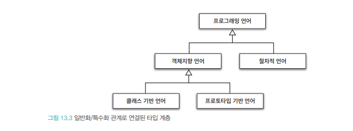

# 설계 품질과 트레이드 오프
역할 책임 협력중 가장 중요한것은 `책임`
객체지향 설계란 올바른 객체에게 올바른 책임을 할당하면서 낮은 결합도와 높은 응집도를 가진 구조를 창조하는 활동

## 데이터 중심 영화 예매 시스템
- 데이터 중심설계는 객체 자신이 포함하고 있는 데이터를 조작하는데 필요한 오퍼레이션을 정의
- 객체 상태에 초점을 맞춤
- 객체의 상태는 구현에 속하는데 구현은 불안정하기 때문에 `변하기 쉬움`

데이터 중심 설계에서는 개체가 포함해야하는 데이터에 중심하게됨


### 캡슐화
상태와 행동을 하나의 객체안에서 모으는 이유는 내부 구현을 외부로 감추기위해
`변경 가능성이 높은 부분을 구현`, `안정적인 부분을 인터페이스` 

### 응집도
`응집도는 모듈에 포함된 내부 요소들이 연관되어 있는 정도`

### 결합도
`의존성의 정도를 나타냄, 다른 모듈에대해 얼마나 많은 지식을 가지고 있는지 나타내는 척도`

## 데이터 설계의 문제점
- 접근자와 수정자 메서드는 객체 내부의 상태에 어떠한 정보도 캡슐화 하지 않음
- 접근자와 수정자에 과도하에 의존하는 `추측에 의한 설계 전략`

`ReservationAgency Class`
```
 Moeny fee;
        if (discountable) {
          ...
        } else {
          ...
        }
        ...
```

한명의 예매 요금을 계산하기 위해 Movie> getFee 호출된 결과를 Money 타입 fee에 저장
Fee의 타입 변경은 협력하는 클래스 변경되어 영향을 미침
`제어 로직이 특정 객체안에 집중되어 하나의 객체가 다수 데이터 격체에 강하게 결합함`


`DiscountCondition` 데이터가 변경되면 DiscountCondition 뿐 아니라 ReservationAgency도 같이 변경

### 새어나간 데이터 책임을 실제 데이터 객체로 옮기기

- Movie는 DiscountCondition 의 목록을 포함하기 때문에 할인 여부를 판단하는 오퍼레이션 포함해야함
`isDiscountable` 을 통해 확인하는 함수가 추가됨
- Screening은 Movie가 할인 정책을 지원할경우 Movie의 `isDiscountable` 호출을 통해 할인 가능한지 판단해야함
- ReservationAgency는 calculateFee 호출해 예매 요금 게산후 Reservation 생성

### 문제점
- DiscountCondition 속성 변경시 `isDiscountable` 메서드 수정해야함, 파급효과가 크다는건 캡슐화 부족에 의미
- Movie 는 `calc 관련 3개 함수`가 내부구현을 인터페이스에 노출하고 있음 -> 사실 할인 정책/조건 만 알면됨 

## 결론
- 이른시기에 내부구현에 초점을 맞추고 잘못된 설계를 불러일으킴
- 올바른 객체지향 설계의 무게중심은 항상 객체 내부가아니라 외부에 맞춰져야 함, 객체간 공동체를 구축해야한다.