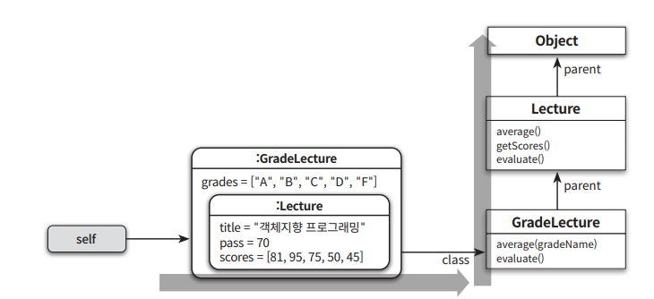
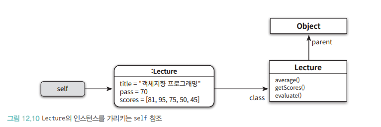
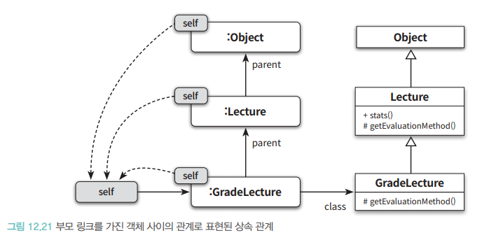

# 다형성

- 상속은 코드 재사용의 목적으로 쓰면 안됨, 타입 계층을 구조화 하기 위해 사용함
- 클라이언트 관점에서 인스턴스들을 동일하게 행동하는 그룹으로 묶기 위해서 사용해야함

## 다형성
※다형성: 여러 타입을 대상으로 동작할 수있는 코드를 작성하는 방법
- 유니버설 다형성
  - 매개변수 다형성: 클래스의 인스턴스 변수나 메서드의 매개변수 타입을 임의의 타입으로 선언한 후 사용하는 시점에 구체적인 타입으로 지정
  - 포함 다형성: 메시지가 동일하더라도 수신한 객체 타입에 따라 실제 수행되는 행동이 달라짐
    - 보편적으로 상속을 많이 사용함
    - 자식 클래스가 부모 클래스의 서브 타입이여야함
    - 클래스를 계층으로 쌓아 올린후 상황에 따라 적절한 메서드를 선택할 수 있는 메커니즘을 제공함
- 임시 다형성
  - 오버로딩 다형성: 하나의 클래스 안에 동일한 이름의 메서드가 존재하는 경우
  - 강제 다형성: 언어가 지원하는 자동적인 


## 상속의 양면성
- 객체지향 근간이 되는 아이디어 → 데이터와 행동을 객체라고 불리는 하나의 실행단위 안으로 통합
- 상속은 프로그램을 구성하는 개념들을 기반으로 다형성을 가능하게 하는 타입 계층을 구축하기 위한 것

상속의 메커니즘을 이해하는데 필요한 개념
- 업캐스팅
- 동적 메서드 탐색
- 동적 바인딩
- self 참조
- super 참조

```java
public class Lecture {
    private int pass;
    private String title;
    private List<Integer> scores = new ArrayList<>();
    
    public Lecture(String title, int pass, List<Integer> scores) {
        this.title = title;
        this.pass = pass;
        this.scores = scores;
    }
    
    public double average() {
        return scores.stream()
                .mapToInt(Integer::intValue)
                .average()
                .orElse(0);
    }
    
    public List<Integer> getScores() {
        return Collections.unmodifiableList(scores);
    }
    
    public String evaluate() {
        return String.format("Pass:%d Fail:%d", passCount(), failCount());
    }
    
    private long passCount() {
        return scores.stream()
                .filter(score -> score >= pass)
                .count();
    }
    
    private long failCount() {
        return scores.size() - passCount();
    }
}
```

- 이수기준 70점인 객체지향 프로그래밍 과목의 수강생 5명에 대한 성적 통계를 구하는 코드
```java
Lecture lecture = new Lecture("객체지향 프로그래밍", 70, Arrays.asList(81, 95, 75, 50, 45));
```

### 상속을 이용해 Lecture 클래스 재사용
- Lecture 출력 결과에 등급별 통계를 추가하는 방법 

```java
public class GradeLecture extends Lecture {
    private List<Grade> grades;
    
    public GradeLecture(String title, int pass, List<Grade> grades, List<Integer> scores) {
        super(title, pass, scores);
        this.grades = grades;
    }
}
```
- Grade 클래스는 등급의 이름과 각 등급 범위를 정의하는 최소 성적과 최대 성적을 인스턴스 변수로 포함
- include는 수강생의 성적이 등급에 포함되는지 검사

```java
public class Grade {
    private String name;
    private int upper, lower;
    
    public Grade(String name, int upper, int lower) {
        this.name = name;
        this.upper = upper;
        this.lower = lower;
    }
    
    public String getName() {
        return name;
    }
    
    public boolean isName(String name) {
        return this.name.equals(name);
    }
    
    public boolean include(int score) {
        return score >= lower && score <= upper;
    }
}
```

- GradeLecture 클래스에서 학생들의 이수 여부와 등급별 통계를 반환하도록 evaluate 메서드를 재정의
```java
public class GradeLecture extends Lecture {
    @Override
    public String evaluate() {
        return super.evaluate() + ", " + gradesStatistics();
    }
    
    private String gradesStatistics() {
        return grades.stream()
                .map(this::format)
                .collect(Collectors.joining(" "));
    }
    
    private String format(Grade grade) {
        return String.format("%s:%d", grade.getName(), gradeCount(grade));
    }
    
    private long gradeCount(Grade grade) {
        return getScores().stream()
                .filter(grade::include)
                .count();
    }
}
```

- GradeLecture evalute 메서드는 super 를통해 Lecture 클래스의 evaluate 를 먼저 호출함
- GradeLecture, Lecture 구현된 두 evaluate 메서드의 시그니처가 완전히 동일함
- 부모 클래스와 자식 클래스에 동일한 시그니처를 가진 메서드가 존재할 경우 자식 클래스 메서드 우선순위가 높음

```java
Lecture lecture = new GradeLecture("객체지향 프로그래밍" ~)
```

- GradeLecture 클래스의 인스턴스 변수에게 evaulte 메시지를 전송하면 Lecture의 evaulate 메서드를 오버라이딩한 GradeLecture 의 evaulte 메서드가 실행됨
- 자식 클래스에 부모클래스는 없던 새로운 메서드를 추가하는것도 가능함

```java
public class GradeLecture extends Lecture {
    public double average(String gradeName) {
        return grades.stream()
                .filter(each -> each.isName(gradeName))
                .findFirst()
                .map(this::gradeAverage)
                .orElse(0d);
    }
    
    private double gradeAverage(Grade grade) {
        return getScores().stream()
                .filter(grade::include)
                .mapToInt(Integer::intValue)
                .average()
                .orElse(0);
    }
}
```

### 데이터 관점의 상속


- GradeLecture 클래스는 Lecture 클래스의 모든 인스턴스 변수와 메서드를 포함하고 있음


- lecture는 GradeLecture의 인스턴스를 가리키기 때문에 특별한 방법을 사용하지 않으면 GradeLecture 안에 포함된 Lecture의 인스턴스에 직접 접근할 수 없다.


- 데이터 관점에서 상속은 자식 클래스의 인스턴스안에 부모 클래스의 인스턴스를 포함하는것으로 볼수있음

### 행동 관점의 상속
- 행동 관점의 상속은 부모 클래스가 정의한 일부 메서드를 자식 클래스의 메서드로 포함시키는걸 의미함
- 부모 클래스의 모든 퍼블릭 메서드는 자식 클래스의 퍼블릭 인터페이스에 포함됨
- 런타임에 시스템이 자식 클래스에 정의 되지 않은 메서드가 있는 경우 메서드를 부모 클래스 안에서 탐색함


- 자식 클래스의 인스턴스를 통해 부모에게 접근하는 방법
- 메시지를 수신한 객체는 class 포인터로 연결된 자신 클래스에서 적절한 메서드가 존재하는지 찾음
- 메서드가 존제하지 않으면 parent 포인터를 따라 부모 클래스를 훑어가며 찾음


## 업캐스팅과 동적 바인딩
### 같은 메시지, 다른 메서드

- 교수별로 강의에 대한 성적을 통계를 계산하는 기능 추가

```java
public class Professor {
    private String name;
    private Lecture lecture;
    
    public Professor(String name, Lecture lecture) {
        this.name = name;
        this.lecture = lecture;
    }
    
    public String compileStatistics() {
        return String.format("[%s] %s - Avg: %.1f", name, lecture.evaluate(), lecture.average());
    }
}
```

```java
Professor professor = new Professor("다익스트라", new GradeLecture("알고리즘", 70, ~));
```

- Professor 클래스으 인스턴스를 생성할때 생성자의 두번째 인자로 Lecture 클래스의 인스턴스를 전달함, GradeLecture 인스턴스를 전달하더라도 동일 객체 참조를 해서 문제가 없음

### 업캐스팅
- 상속을 이용하면 부모 클래스의 퍼블릭 인터페이스가 자식 클래스의 퍼블릭 인터페이스에 합쳐져서  부모 인스턴스에게 전송할 메시지를 자식 클래스의 인스턴스에 전송 가능해짐

```java
Lecture lecture = new GradeLecture(...)
```

- 다운캐스팅: 반대로 부모 클래스의 인스턴스를 자식 클래스 타입으로 변환하기 위해서는 명싲거인 타입 캐스팅이 필요함
```java
Lectrue lecture = new GradeLecture(...);
GradeLecture GradeLecture = (GradeLecture)lecture;
```


- Lecture의 모든 자식 클래스는 evaluate 를 이해할수있기 때문에 무한한 확장 가능성을 가지게 됨

### 동적 바인딩
- 함수를 호출하는 전통적인 언어들은 호출될 함수를 컴파일 타임에 결정 → 정적 바인딩
- 실행될 메서드를 런타임에 결정하는 방식을 → 동적 바인딩

## 동적 메서드 탐색과 다형성
- 메시지를 수신한 객체는 먼저 자신을 생성한 클래스에 적합한 메서드가 존재하는지 검사함
- 메서드를 찾기 못하면 부모 클래스에서 메서드 탐색을 계속함, 상위 계층까지 체이닝함
- 상속 계층의 가장 최상위 클래스에 이르렀지만 찾지 못하면 예외를 발생시키며 종료함

- 객체가 메시지 수신하려면 컴파일러는 self 참조라는 임시 변수를 자동으로 생성한 후 메시지를 수신한 객체를 가리키도록 설정
- 동적 메서드 탐색은 self 가 가리키는 객체의 클래스에서 시작해서 상속 게층의 역방향으로 이뤄짐, 탐색이 종료되는 순간 self 참조는 자동으로 사라짐
---
메서드 탐색과정

1. 메시지를 수신한 시점의 GradeLecture 인스턴스의 메모리 상태
2. 시스템은 메시지 처리할 메서드를 탐색하기 위해 SELF 참조가 가르키는 메모리로 이동
3. 메모리 객체의 혅내 상태를 표현하는 데이터와 객체의 클래스를 가르키는 class 포인터가 존재
4. class 퐁니터를 따라 이동하면 메모리에 로드된 GradeLecture 클래스의 정보를 읽을 수 있음
5. 이 목록 안에서 메시지를 처리할 적절한 메서드가 존재하면 해당 메서드를 실행한 후 동적 메서드 탐색 종료



- 메서드 탐색은 자식 클래스에서 부모 클래스 방향으로 진행
- 자식 클래스가 부모 메서드보다 먼저 탐색되어서 우선순위를 가지고 있음
- `자동적인 메시지 위임` : 자식 클래스는 자신이 이해할수 없는 메시지를 받으면 부모로 위임
- `동적인 문맥`: 메시지를 수신했을때 실제로 어떤 메서들르 실행할지 결정하는 것은 컴파일 시점이 아닌 실행시점에서 이뤄짐

### 자동적인 메시지 위임
- 적절한 메서드를 찾을때까지 상속 계층을 따라 부모 클래스로 처리가 위임됨
- 상속을 이용할 경우 프로그래머가 메시지 위임과 관련된 코드를 명시적을 작성할 필요가 없음

#### 메서드 오버라이딩
```java
Lecture lecture = new Lecture(...);
lecture.evalute()
```



- 런타임에 자동으로 self 참조가 메시지 수신객체를 가리키도록 설정됨


- evaluate 를 자식에 오버라이딩 돼서 자식 메서드가 실행됨

### 메서드 오버 로딩
```java
GradeLecture lecture = new GradeLecture(...)
lecture.average('A')
```


- average 메서드를 GradeLecture 클래스에서 발견할수있기때문에 동적 메서드 탐색은 시작되는 첫번쨰 클래스에서 종료

```java
lecture.average()
```


- 메서드 오버라이딩은 자식클래스가 부모클래스에 존재하는 메서드와 동일한 시그니처를 가진 메서드를 재정의해서 부모 클래스의 메서드를 가리지만
- 이름은 같지만 시그니처가 다른경우 → 자식부터 알맞은 메서드를 찾아 탐색하게됨

## 동적인 문맥
- lecture.evaluate() 라는 메시지 전송 코들만으로는 어떤 클래스의 어떤 메서드가 실행될지를 알수 없음
- 수신한 객체가 무엇이냐에 따라 메서드 탐색을 위한 문맥이 동적으로 바뀜
- self 참조가 동적 문맥을 결정한다는 사실은 어떤 메서드가 실행될지를 예상하기 어렵게 만듬


- self 전송은 깊은 상속계층과 계층 중간중간 함정처럼 숨겨져 있는 메서드 오버라이딩과 만나면 극단적으로 이해하기 어려운 코드가 만들어짐


### 이해할 수 없는 메시지
#### 정적 타입 언어와 이해할수 없는 메시지
- 정적타입언어는 컴파일 에러를 발생시킴
#### 동적 탕비 언어와 이해할 수 없는 메시지
- 코드를 실행해보기전까지 메시지 처리 가능 여부를 판단할 수 없음
- 상속 계층안의 어떤 클래스도 메시지를 처리 못하면 메서드 탐새ㅔㄱ은 최상우 ㅣ클래스에 이르게 되고 최종 적으로 예외를 던짐


- 동적 타입 언어에서는 이해할수 없는 메시지에 대해 예외를 던지는것 외에더 선택 할수 있음`doseNotUnderstand`, `methodMissing` 에 으답할수 있는 메서드를 구현
- 동적 타입언어는 이해할 수 없는 메시지를 처리할 수 있는 능력을 가짐으로써 메시지가 선언된 인터페이스와 메서드 정의된 구현을 분리함
- 정적타입은 안정적이지만 유연성을 잃음

### Self 대 super
- self 의 가장 큰 특직은 동적참조 
- super 참조: 자식 클래스에서 부모클래스의 구현을 재사용할떄 사용
- super 는 메서드를 호출하지 않고 메서드를 전송함

```java
public class FormattedGradeLecture extends GradeLecture {
    public FormattedGradeLecture(String name, int pass, List<Grade> grades, List<Integer> scores) {
        super(name, pass, grades, scores);
    }
    
    public String formatAverage() {
        return String.format("Avg: %1.1f", super.average());
    }
}
```


- super 는 조상을 찾아가 실행함
- super 참조 용도는 부모 클래스에 정의된 메서드를 실행하기 위함이 아님
- super 참조의 정확한의도는 지금 이클래스의 부모 클래스에서 부터 탐색을 시작하세요의 의미
---
- slef 전송이 메시지를 수신하는 개체의 클래스에 따라 메서드를 탐색할 시작 위치를 동적으로 결정
- super는 항상 메시지 전송하는 클래스의 부모 클래스에서 부터 시작됨
- slef 에서는 메시지 탐색을 시작하는 클래스는 미정, super 전송에서는 미리 정해짐

## 상속 대 위임
- self 참조가 동적인 문맥을 겾렁한다는 사실을 이해하고 나면 상속을 바라보는 새로운 시각이 형성됨
- 자식 클래스에서 부모 클래스로 self 참조를 전달하는 메커니즘으로 상속을 바라봄

### 위임과 self 참조
- 자식 클래스의 인스턴스를 생성할 경우, 개념적으로 ㅈ사기 클래스의 인스턴스 안에 부모 클래스의 인스턴스를 포함하는것으로 표현

 
 
- 메서드 탐색 중에는 자식 클래스의 인스턴스와 부모 클래스의 인스턴스가 동일한 self 참조를 공유하는것으로 봐도 무방함




```
class Lecture
  def initialize(name, pass)
    @name = name
    @pass = pass
  end
  
  def stats(this)
    "#{this.letter_grades} #{average(this)}"
  end
end

def getEvaluationMethod
  ->(lecture) { lecture.average >= 8 }
end
```

- stats 메서드의 인자로 this를 전달받음
- this 에는 메시지를 수신한 객체를 가리키는 self 참조가 보관됨
- stats 메서드는 인자로 전달된 this 에게 getEvaluationMethod 메시지를 전송
- Lecture의 getEvaluationMethod 메서드가 아닐수도 있다는 사실을 명시적으로 드러냄
- this 에 전달되는 객체가 Lecture의 인스턴스라면 Lecture의 getEvaluationMethod 메서드가 실행되겠지만
- 다른 객체가 전달된다면 해당 객체의 메서드를 실행함

```
class GradeLecture {
def initialize(name, pass, grades, scores)
  @name = name
  @pass = pass
  @grades = grades
  @scores = scores
end
  def stats(this)
    @parent.stats(this)
  end
end
```

- 자식 클래스의 인스턴스가 부모 클래스의 인스턴스에 대한 링크를 포함하는 것으로 상속관계를 흉내냄
- Lecture 처럼 GradeLecture의 stats 메서드를 호출하기 위해서는 실행 문맥인 GradeLecture의 인스턴스를 직접 전달해야함

```java
grade_lecture = GradeLecture.new("객체지향 프로그래밍", 70, [], [10, 20, 30, 40, 50])
puts grade_lecture.stats(grade_lecture)
```

1. GradeLecture 인스턴스 변수인 @parent에 Lecture 인스턴스를생성해서 저장함
   - GradeLecture 인스턴스에서 Lecture 인스턴스로 이동할 수있는 명시적인 링크가 추가됨
2. GradeLecture의 stats 메서드는 추가 작업 없이 @parent에 그대로 요청을 전달
    - 이것은 자식 클래스에 메서드가 존재하지 않을 경우 부모 클래스에서 메서드 탐색을 계속하는 동적 메서드 탐색 과정을 흉내
3. GradeLecture의 getEvaluationMethod 메서드는 stats 메서드처럼 요청을 @parent 에 전달하지 않고 자신만의 방법으로 메서드를 구현
    - GradeLecture 외부에서는 Lecture 의 getEaludationMethod 가 감춰짐, 부모클래스의 메서드와 동일한 메서드를 구현하고 부모 클래스와는 다른방식으로 구현해서 오버라이딩함
4. GradeLEcture의 stats 메서드는 인자로 전달된 this를 그대로 Lecture의 stats 메서드에 전달함
   - Lecture의 stats 메서드는 인자로 전달된 this에게 getEvaluationMethod 메시지를 전송하기 때문에 Lecture의 getEvaluationMethod 메서드가 아니라 GradeLecture의 getEvaluationMethod 가 실행됨
   - 자신이 수신한 메시지를 다른 객체에게 동일하게 전달해서 처리를 요청하는것을 위임
- `위임`은 본질적으로 자신이 정의하지 않거나 처리할수 없는 속성 또는 메서드의 탐색 과정을 다른 객체로 이동 시키기 위해 사용함

### 프로토 타입 기반의 객체지향 언어
- 객체를 이용해서도 상속을 흉내낼수 있음
- 프로토타입 기반의 객체지향 언어에서 상속을 구현하는 유일한 방법은 객체 사이읭 위임을 이용
