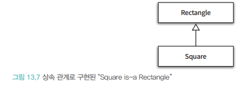

# 메시지와 인터페이스
객체지향의 오해는 클래스의 집합으로 앱이 구성된다고 생각하는것, 클래스는 중요하지만 구현의 도구일 뿐임
클래스가아니라 객체를 지향해야함


훌륭한 퍼블릭 인터페이스를 얻기위해서는 책임주도 설계 방법으론 부족하고 `재사용 가능한 설계`도 같이 구성 되어야함
기본적인 모델을 아래와같이 볼수있다.

## 협력과 메시지
### 클라이언트-서버 모델
협력: 객체가 다른객체에게 무언가를 요청할때 발생함

`클라이언트-서버 모델` : 두 객체 사이의 협력관계를 전통적인 메타포로 설명


- 객체가 서로에게 필요한 서비스를 제공하고 메시지를 보내며 응답하고 있음
- Movie는 할인요금 계산하기위한 정보가 부족해 DiscountCondition에게 요청을 보냄


객체를 협락에 참여하는 동안 클라이언트-서버 역할을 동시에 수행하게됨, 대부분의 사람들은 수신하는 메시지에 초점을 맞추지만
메시지를 받고 보내는 집합고 고려해야함 

### 메시지와 메시지 전송
※ `메시지`: 객체가 다른 객체와 협력하기 위해 사용하는 의사소통 메커니즘
- 메시지 구성: 오퍼레이션,인자로 구성되며 전송은 `메시지 수신자`를 추가

### 메시지와 메서드
메시지를 수신할때 코드의 실행은 수신자의 실제 타입에서 알수있음
DiscountCondition 으로 정의 되었지만 실제 실행되는 코드는 인터페이스를 실체화 한 클래스의 종류에 따라 달라짐

※ `메서드`: 실제로 실행되는 함수 또는 프로시저를 의미함

이는 컴파일 시점에서 의미기 달라 질수 있음 → 어떤 코드가 실행될지 정확하게 알수 없고, 실행 시점에서 코드는 메시지를 수신하는 개체의 타입에 따라 달라지게 되고
메시지에 응답할 수 있는 객체가 존재하고 그 객체가 적절한 메서드를 선택해서 응답할거라 믿음

메시지와 메서드 구분은 메시지 전송자와 수신자가 얇고 가는 끈으로 `느슨하게 결합`될수 있게 도와줌
이 메커니즘은 객체사이 결합도를 낮추고 유연하고 확장 가능한 코드를 작성 하게 도와줌

### 퍼블릭 인터페이스와 오퍼레이션
※ `퍼블릭 인터페이스`: 객체가 협력에 참여하기 위해 외부에서 수신할 수 있는 메시지의 묶음

DiscountCondition 인터페이스에 정의된 isSatisfiedBy 가 오퍼레이션에 해당함 → 메시지를 수신했을때 실행되는 코드는 메서드
PeriodCondition에 정의된 각각의 isSatisfiedBy는 실제 구현을 포함하게 됨


### 시그니처
※ `시그니처`: 오퍼레이션의 이름과 파라미터 목록을 합쳐서 시그니처라고 함

## 인터페이스와 설계 품질
좋은 인터페이스는 `최소한의 인터페이스` 와 `추상적인 인터페이스`라 는 조건을 만족해야함 → 책임주도 설계를 통해 달성할수 있음

***메시지를 먼저 선택함***으로 무관한 오퍼레이션이 인터페이스에 스며드는걸 방지할 수 있음

### 디미터 법칙


※ `디미터 법칙`: 메시지 수신자의 내부 구조에 강하게 결합되지 않도록 협력 경로를 제한하는 것

Screening이 ReservationAgeny와 결합도가 너무 높음 → ReservationAgency 사소 한 변경은 여러 객체에게 영향을 주는 의존성 집결지가 되어버림

아래 조건을 만족하는 인스턴스에만 메시지를 전송하도록 프래그래밍 해야함
- this 객체
- 메서드의 매개변수
- this의 속성
- this의 속성인 컬렉션 요서
- 메서드 내에서 생긴 지역객체

```java
 public Reservation reserve(Screening screening, Customer customer, int audienceCount) {
        boolean discountable = checkDiscountable(screening);
        Money fee = calculateFee(screening, discountable, audienceCount);
        return createReservation(screening, customer, fee, audienceCount);
    }

```

메서드 인자로 전달된 ***Screening 인스턴스 에게만 메시지 전송***함
Screening 내부구현을 변경할때 ReservationAgency를 함께 변경할 필요가 없게됨


디미터 법칙을 통해 부끄러움 타는 코드를 작성할수 있게됨

```java
screening.getMovie().getDiscountConditions();
```
위코드는 디미터 법칙을 위반하는 전형적인 모습

메시지 전송자가 수신자의 내부 구주에 물어보고 연쇄적으로 메시지를 전송함 ***기차충돌*** 이라고 부르는 현상

```java
screening.calcaulateFee(audienceCount);
```
전송자(Screening) 은 더이상 메시지 수신자의 내부 구조에 묻지 않게됨 → 원하는 것을 명시하고 단순히 수행하도록 함

디미터 법칙은 객체 내부구조를 묻는 메시지가 아니라 수신자에게 무엇을 시키는게 좋은 메시지라고 이야기함

### 묻지말고 시켜라
메시지 전송자는 수신자의 상태기반으로 결정을 내리고 상태를 변경하면 안됨, 캡슐화 위반할 여지가 높음

`묻지말고시켜라` 원칙은 밀접하게 연관된 정보와 행동을 함께 가지는 객체를 만들 수 있음, 객체지향의 기본은 변경될 확률이 높은 정보와 행동을 하나 단위로 통합 → 자연스럽게 정보와 행동을 동일한 클래스 안에 둘수 있게됨
그리고 자연스럽게 응집도높은 클래스를 얻게 된다.

상태를 묻는 오퍼레이션 → 행동을 요청하는 오퍼레이션으로 대처하기

### 의도를 드러내는 인터페이스
인터페이스는 객체가 어떻게 하는지가 아니라 무엇을 하는지 서술이 필요함

- 메서드가 작업을 어떻게 수행을하는지 나타내도록 이름짓기(ex PeriodCondition, SequenceCondition) 메서드를 명명
    - 메서드 수준에서 캡슐화를 위반, 메서드 이름을 변경한다는건 메시지 전송하는 클라이언트 코드도 함께 변경되어야함, 책임을 수행하는 방법을 드러내는 메서드는 번경에 취약함
    - 내부구현을 정확하게 이해하지 못한다면 동일한 작업을 수행한다고 인지하기 어려움
- 메서드는 어떻게가 아니라 무엇을 하는지 드러내는것
  - 어떻게 : 메서드 내부 구현을 설명하는 이름 → 협력을 설계가 시작하는 이른시기부터 클래스의 내부 구현에 관해 고민하게됨
  - 무엇 : 객체가 협력안에서 수행해야하는 책임에 대해 고민
- isSatisfiedBySequence,isSatisfiedByPeriod -> isSatisfiedBy 로 변경하는 것이 적절하게 됨
- 동일한 함수명은 동일한 역할은 한다고 인지하게됨 → 인터페이스 정의를 할수 있게됨

### 함께 모으기

```java
import 객체설계.TicketSeller;

public class Theater {
  private TicketSeller ticketSeller;
  
  public Theater(TicketSeller ticketSeller) {
    this.ticketSeller = ticketSeller;
  }
  
  public void enter(Audience audience) {
   if(audience.getBag().hasInvitation()) {
     Ticket ticket = ticketSeller.getTicketOffice().getTicket();
     audience.getBag().setTicket(ticket);
   } else {
     Ticket ticket = ticketSeller.getTicketOffice().getTicket();
     audience.getBag().minusAmount(ticket.getFee());
     ticketSeller.getTicketOffice().plusAmount(ticket.getFee());
     audience.getBag().setTicket(ticket);
   }
  }
}
```
`audience.getBag().minusAmount(ticket.getFee());`

여기서 Theater는 Audience 뿐 아니라 내부에 포함된 Bag에게도 메시지를 전송함 내부구조에 결합되게됨
결국 디미터 법칙을 위반한 설계는 인터페이스와 구현 분리 원칙을 위반함

객체 내부 구조는 구현에 해당함 Audience가 Bag를 포함하는 사실은 Audience 내구 구현에 속하며 자신을 자유롭게 변경할 수 있어야함
Bag를 getBag로 받으면 ***객체의 구현이 퍼블릭 인터페이스를 통해 외부로 새어나감***
Theater 가 알아야할 정보들이 많아짐



Theater는 Audience의 내부 구조에 묻지 말고 작업을 시켜라 스타일을 따르는 퍼블릭 인터페이스를만들어야함

1. Audience가 Ticket 을 가지도록 만들기
   ```java
    public class TicketSeller {
    public void setTicket(Audience audience) {
     if(audience.getBag().hasInvitation()) {
        Ticket ticket = ticketOffice.getTicket();
    audience.getBag().setTicket(ticket);
     } else {
        Ticket ticket = ticketOffice.getTicket();
    }
   } 
    ```
2. Theater 는 자신의 속성을 포함하고있는 TicketSeller의 인스턴스에게만 메시지 전송
    ```
    public void enter(Audience audience) {
          ticketSeller.sellTo(audience);
      }
    ```

3. TicketSeller 가 원하는건 Audience가 Ticket을 소유하도록 만들기
    ```java
    public Long setTicket(Ticket ticket) {
            if(bag.hasInvitation()) {
                bag.setTicket(ticket);
                return 0L;
            } else {
                bag.setTicket(ticket);
                bag.minusAmount(ticket.getFee());
                return ticket.getFee();
            }
        }
    ```

4. TicketSeller 속성으로 포함하고 있는 TicketOffice의 인스턴스와 인자로 전달된 Audience에게만 메시지 전송
    ```java
        public void setTicket(Ticket ticket) {
        ticketOffice.plusAmount(ticket.getFee());
    }
    ```
   
5. Audience 는 setTicket 에서 Bag가 hasInvitation 메서드를 이용해 초대권을 가지고 있는지 묻는걸 확인할 수있음 (디미터 위반) Audience의 setTicket을 Bag로 옮겨야함
    ```java
    public Long setTicket(Ticket ticket) {
            if(hasInvitation()) {
                this.ticket =ticket;
                return 0L;
            } else {
                this.ticket = ticket;
                minusAmount(ticket.getFee());
                return ticket.getFee()
            }
        }
    ```

6. Audience의 setTicket 메서드가 Bag의 setTicket 메서드를 호출하도록 수정시키면 법칙을 만족함
    ```java
    public Long setTicket(Ticket ticket) {
            return bag.setTicket(ticket);
        }
    ```
   
#### 인터페이스에 의도 드러내기
***setTicket*** 이 의도를 명확하게 드러내고 있지 않음  개발자가 미묘한 차이점을 정확하게 이해하기 어렵다.

TicketSeller, Audience, Bag 입장에서 setTicket이라는 이름이 협력하는 클라이언트 의도를 명확하게 드러내지 못함

setTicket → sellTo 로 변경


### 원칙의 함정
설계는 트레이드 오프의 산물 → 설계를 적절하게 트레이드 오프 할 수 있는 능력이 숙련자와 초보자를 구분하는 기준이 됨

### 디미터 법칙은 도트를 강제하는 규칙이 아님

`IntStream.of(1, 15, 20, 3, 9).filter(x -> x -> 10).distinct().count();`

모든 API 함수는 IntStream을 동일한 클래스를 반환함, 디미터의 법칙을 위반하지 않음 디미터 법칙은 `결합도 와 관련`

### 결합도와 응집도 충돌

```java
public void enter(Audience audience) {
   if(audience.getBag().hasInvitation()) {
     Ticket ticket = ticketSeller.getTicketOffice().getTicket();
     audience.getBag().setTicket(ticket);
   } else {
     Ticket ticket = ticketSeller.getTicketOffice().getTicket();
     audience.getBag().minusAmount(ticket.getFee());
     ticketSeller.getTicketOffice().plusAmount(ticket.getFee());
     audience.getBag().setTicket(ticket);
   }
  }
```

`Audience`
1. Audience 의 캡슐화를 위반하기에 Theater 는 Audience의 내부 구조에 의존하고 있음 -> Audience에게 위임 메서드를 추가

```java
    public Long buy(Ticket ticket) {
            if(bag.hasInvitation()) {
                bag.setTicket(ticket);
                return 0L;
            } else {
                bag.setTicket(ticket);
                bag.minusAmount(ticket.getFee());
                return ticket.getFee();
            }
        }
```
2. Audience 는 응집도가 높아짐, 내부 구조를 감추는 것은 협력에 참여하는 객체들의 결합도와 응집도를 높임 → 하지만 항상 긍정적인 효과가 나오는건 아님
상관 없는 객체의 책임도 한거번에 생기게 됨

`PeriodCondition`

```java
public class PeriodCondition implements DiscountCondition {
  public boolean isSatisfiedBy(Screening screening) {
    return screening.getStartTime().getDayOfWeek().equals(dayOfWeek) &&
            startTime.compareTo(screening.getStartTime().toLocalTime()) <= 0 &&
            endTime.compareTo(screening.getStartTime().toLocalTime()) >= 0;
  }    
}
```
1. 얼핏보면 Screen 내부 상태를 가져와 캡슐화 위반이라 생각함, 할인 판단 롲기을 Screen isDiscountable 로 옮기면 PeriodCondition이 메서드를 호출하도록
변경하면 묻지 말고 시켜라를 준수하는 퍼블릭 인터페이스를 얻을거라 생각
   1. Screening 의 본질적인 책임을 놓치고있음
   2. PeriodCondition 은 할인조건을 판단하는 책임이 있음
   3. 또다른 의존성이 생기게됨

`자료구조라면 디미터 법칙을 적용할 필요가 없다.`

## 명령 쿼리 분리원칙
※`명령 쿼리 분리원칙`: 퍼블릭 인터페이스에 오퍼레이션을 정의할 때 참고 할수 있는 지침을 제공
- 루틴 : 절차를 묶어 호출 가능하도록 이름을 부여한 기능 (프로시저와 함수로 구분)
- 프로시저 : 부수효과 발생 + 값반환 X
- 함수 : 값 반환 O 부수효과 X

질문이 답변을 수정해서는 안되는 규칙

### 이벤트
```java
import java.time.Duration;
import java.time.LocalDateTime;

public class Event {
    private String subject;
    private LocalDateTime from;
    private Duration duration;

    public Event(String subject, LocalDateTime from, Duration duration) {
        this.subject = subject;
        this.from = from;
        this.duration = duration;
    }
}

```

명령과 쿼리가 한 메소드 안에서 이루어지면 디버깅도 힘들어짐

### 명령-쿼리 분리와 참조 투명성

