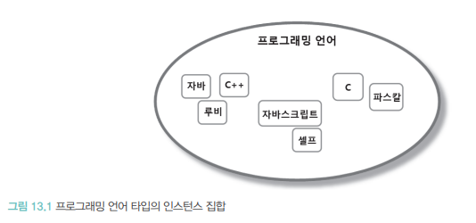
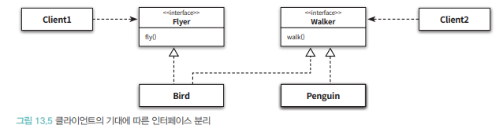

# 의존성 관리하기

협력은 필수적이지만 과도한 협력은 설계를 곤경에 빠트림

## 의존성 이해하기

### 변경과 의존성

- 객체가 협력하기위해 다른 객체를 필요할때 두 객체 사이에 의존성이 존재한다.
  - **실행 시점**: 의존하는 객체가 정상적으로 동작하기 위해 실행 시에 의존 대상 객체가 반드시 존재해야함
  - **구현 시점**: 의존 대상 객체가 변경될 경우 의존하는 객체도 함께 변경함

---

```java
public class PeriodCondition implements DiscountCondition {
    private DayOfWeek dayOfWeek;
    private LocalTime startTime;
    private LocalTime endTime;

    public PeriodCondition(DayOfWeek dayOfWeek, LocalTime startTime, LocalTime endTime) {
        this.dayOfWeek = dayOfWeek;
        this.startTime = startTime;
        this.endTime = endTime;
    }

    public boolean isSatisfiedBy(Screening screening) {
        return screening.getStartTime().getDayOfWeek().equals(dayOfWeek) &&
                startTime.compareTo(screening.getStartTime().toLocalTime()) <= 0 &&
                endTime.compareTo(screening.getStartTime().toLocalTime()) >= 0;
    }
}
```

- 실행시점 PeriodCondition 인스턴스가 정상동작하기위헤 Screening 인스턴스가 존재해야함
  - 의존성은 방향을 가지며 항상 단방향



- 두 요소 사이 의존성은 의존되는 요소가 변경 될 때 의존하는 요소도 함께 변경됨


- `PeriodCondition`은 `DayOfWeek`, `LocalTime`, `Screening`에 대해 의존성을 가짐
  - `DayOfWeek`, `LocalTime`, `Screening`이 변경될 경우 `PeriodCondition`도 함께 변경됨

### 의존성 전이

- 의존성은 전이 될 수 있다.
  - `PeriodCondition`이 `Screening`에 의존할 경우 `PeriodCondition`은 `Screening`이 의존하는 대상에 자동적으로 의존


- 의존성은 함께 변경 될수 있는 가능성ㅇ르 의미함, 모든 경우에 의존성이 전이 되는것은 아님
  - `직접 의존성`: 한요소가 다른 요소에게 직접 의조한 경우
  - `간접 의존성`: 직접적인 관계는 존재하지 않지만 의존성 전이에 의해 영향이 전파되는 경우

### 런타임 의존성과 컴파일 타임 의존성

- `런타임 의존성`:애플리케이션이 실행되는 시점을 가르킴
  - `캄파일 타임 의존성`: 미묘하게 다름, 작성된 코드를 컴파일하는 시점 + 문맥에 따라서는 코드 그자체를 이야기
  - 동적인 언어들은 컴파일이 수행 되는 시점으로 이해하면 의미가 모호해짐
  - 런타임 의존성과 컴파일 의존성이 다를수 있음
  - 


- `Movie`는 할인정책 모두 적용 가능해야함, 위와같이 협력함
  - `AmountDiscountPolicy` 와 `PercentDiscountPolicy`는 어떤 의존성도 존재하지 않음
  - `Movie` 에서도 어떠한 언급 조차 없음

```java
public class Movie {
    ...
    private DiscountPolicy discountPolicy;
    ...

    public Moive(DiscountPolicy discountPolicy) {
        ...
        this.discountPolicy = discountPolicy;
        ...
    }

    public Money calculateMovieFee(Screening screening) {
        return fee.minus(discountPolicy.calculateDiscountAmount(screening));
    }
}
```

- `Movie` 클래스에서는 할인 클래스로 향하는 어떤 의존성도 존재하지 않음
  - 런타임 의존성을 보면 다름 → 각각의 할인 인스턴스와 협력해야함



- 다양한 인스턴스와 협력하기 위해서는 구체적인 클래스를 알기보단 컴파일 구조와 런타임구조를 분리할수록 설계가 유연해지고 재사용이 가능함

### 컨텍스트 독립성

- 유연, 확장 가능한 설계는 **컴파일 타임 의존성과 런타임 의존성이 달라야함**
  - `컨텍스트 독립성`: 클래스가 특정한 문맥에 강하게 결합될 수록 다른 문맥에서 사용하기 어려움, 문맥에 대해 최소한의 가정으로 이루어지면 다른 문맥에서 재사용이 쉬워짐

### 의존성 해결하기

- 컴파일 의존성 → 런타임 의존성의로 대체 해야함
  - `의존성 해결`
      - 객체를 생성하는 시점에 생성자를 통해 의존성 해결
      - 객체 생성후 setter 메서드를 통해 의존성 해결
      - 메서드 실행 시 인자를 이용해 의존성 해결

---

`생성자를 통해서 의존성 정리`

```java
Movie avatar=new Movie("아바타",
        Duration.ofMinutes(120),
        Money.wons(10000),
        new AmountDiscountPolicy(Money.wons(800),
        new SequenceCondition(1),
        new SequenceCondition(10),
        new PeriodCondition(DayOfWeek.MONDAY,LocalTime.of(10,0),LocalTime.of(11,59)),
        new PeriodCondition(DayOfWeek.THURSDAY,LocalTime.of(10,0),LocalTime.of(20,59))));
```

- `Movie` 생성자에 PerdiodCondition 인스턴스를 전달하면 비율 할인 정책에 따라 요금을 계산하게됨
---
  - `Movie` 인스턴스를 생성한 후에 메서드를 이용해 의존성 해결하는 방법
    - 아래경우 stter 가 필요함

```java
Movie avatar = new Movie(...);
avatar.setDiscountPolicy(new AmountDiscountPolicy(...));
```
---
- setter 메서드 이용하는 방식은 객체를 생성한 후에도 의존하고 있는 대상을 변경할수 있는 가능성을 열어놔야함
```java
Movie avatar = new Movie(...);
avatar.setDiscountPolicy(new AmountDiscountPolicy(...));
        ...
avatar.setDiscountPolicy(new PercentDiscountPolicy(...));
```
---

- 더좋은 방법은 setter를 혼합하는 방식
 ```java
Movie avatar = new Movie(..., new PercentDiscountPolicy(...));

avatar.setDiscountPolicy(new AmountDiscountPolicy(...));
```
---
- Movie 가 항상 할인 정책을 알 필요 없고 계산할때만 일시적으도 알아도 된다면 메서드 인자를 이용해 해결
```java
public class Movie {
    public Money calculateMovieFee(Screening screening, DiscountPolicy discountPolicy) {
        return fee.minus(discountPolicy.calculateDiscountAmount(screening));
    }
}
```

## 유연한 설계
### 의존성과 결합도
- 객체지향 패러다임의 근간은 협력, 협력을 통해 애플리케잇녀에 생명력을 불어넣음
  - **의존성이 과하면 문제**가 된다

```java
public class Movie {
    private DiscountPolicy discountPolicy;

    public Movie(DiscountPolicy discountPolicy) {
        this.discountPolicy = discountPolicy;
    }
    
    public Money calculateMovieFee(Screening screening) {
        return fee.minus(discountPolicy.calculateDiscountAmount(screening));
    }
}
```
- 코드의 협력자체는 바람직하지만 **의존성의 정도가 문제**가됨
  - 의존성 자체가 나쁜건 아니지만 바람직하지 않은 의존성의 문제
  - 추상화된 `DiscountPolicy` 에 대한 의존성이 바람직 구체화된 정책에 대한 의존성은 바람직 하지 않음
  - `결합도`: 바람직한 의존성과 바람직하지 않은 의존성을 가리키는 좀더 세련된 단어

### 지식이 결합을 낳는다
- 서로에 대해 알고 있는 지식의 양이 결합도를 결정함
  - `DiscountPolicy` 에 추상화된 정책일수록 지식의 양을 몰라서 결합도가 느슨해진다.

### 추상화에 의존하라
- `추상화`: 어떤 양상, 세부사항, 구조를 좀더 명확하게 이해하기 위해 특정 절차나 물체를 의도적으로 생략, 감춤
  - `DiscountPolicy` 는 `PercentDiscountPolicy` 클래스가 비율 할인 정책에 따라 할인 요금 게산을 하는 사실을 숨김
  - 추상화와 결합도의 관점에서 의존 대상을 다음과같이 구분함
    1. 구체 클래스 의존성
    2. 추상클래스 의존성
    3. 인터페이스 의존성

  - 인터페이스는 상속 계층을 모르더라도 협력가능
  - 추상클래스는 지식의 양이 구체클래스보다 적음, 상속 계층만 알면됨
  - 구체클래스는구현을 알아야함

### 명시적인 의존성

```java
import 객체지향.AmountDiscountPolicy;

public class Movie {
  ...
  private DiscountPolicy discountPolicy;

  public Movie(DiscountPolicy discountPolicy) {
    this.discountPolicy = new AmountDiscountPolicy(...);
  }
}
```

 {
    ...
    this.discountPolicy = new AmountDiscountPolicy(Money.wons(800), ...)
                            new SequenceCondition(1),
                            new SequenceCondition(10),
    ...
  }
}
```

- `Movie` 가 `AmountDiscountPolicy` 의 구현에 의존하고 있어서 지식의 양이 늘고 강결합 하게됨

### 가끔은 생성해도 무방하다
- `new` 가 항상 나쁜건 아님, 방식이 유영한 경우도 존재함

```java
import java.time.Duration;

public class Movie {
  private DiscountPolicy discountPolicy;

  public Movie(String title, Duration runningTime, Money fee, DiscountPolicy discountPolicy) {
    this(title, runningTime, fee, discountPolicy, null);
  }

  public Movie(String title, Duration runningTime, Money fee, DiscountPolicy discountPolicy, DiscountCondition... discountConditions) {
    this.title = title;
    this.runningTime = runningTime;
    this.fee = fee;
    this.discountPolicy = discountPolicy;
    this.discountConditions = Arrays.asList(discountConditions);
  }
}
```

- 추가된 생성자 안에서 `AmountDiscountPolciy` 클래스 인스턴스를 생성한다는것을 알수 있음
- 첫번째 생성자 안에서 두번째 생성자를 호출함
- `AmountDiscountPolicy` 와 협력해서 `DiscountPolicy` 인스턴스로 의존성을 교체 가능함


### 표준 클래스에 대한 의존은 해롭지 않다
- 의존성이 불편한 이유ㅜ는 그것이 항상 변경에 대한 영향을 암시함
- JDK ArrayList 경우 수정될 확률은 0에 수렴함

```java
public abstract class DiscountPolicy {
  private List<DiscountCondition> conditions = new ArrayList<>();
}
```

- 클래스를 직접 생성하더라도 추상적 타입을 사용하면 확장성에 유리함
- 의존성에 의한 영향이 적은 경우도, 추상화 의존하고 의존성을 명시적으로 드러내는게 좋은 습관

```java
public abstract class DiscountPolicy {
  private List<DiscountCondition> conditions = new ArrayList<>();
  
  public void switchConditions(List<DiscountCondition> conditions) {
    this.conditions = conditions;
  }
}
```

### 컨텍스트 확장하기
- `Movie` 의 확장
  - 할인을 제공하지 않는 영화의 예매 요금을 계산
  - discountPolicy는 어떤 객체도 할당하지 않음

```java
public class Movie {
    public Movie(String title, Duration runningTime, Money fee) {
        this(title, runningTime, fee, null, null);
    }
    
    public Movie(STring title, Duration duration, Money fee, DiscountPolicy discountPolicy, DiscountCondition... discountConditions) {
        this.title = title;
        this.runningTime = runningTime;
        this.fee = fee;
        this.discountPolicy = discountPolicy;
        this.discountConditions = Arrays.asList(discountConditions);
    }
    
    public Moneny calculateMovieFee(Screening screening) {
        if(discountPolicy == null) {
            return fee;
        }
        
        return fee.minus(discountPolicy.calculateDiscountAmount(screening));
    }
}
```

- 체이닝 기법을 통해 생성자 기본값으로 `null` 을 넘겨줌
- `Movie` 내부 코드를 직접 수정해야함, 예외케이스를 처리하기 위해서 Movie의 내부 코드를 직접 수정해야함
- `Movie` 와 `DiscountPolicy` 협력하던 방식을 따르도록 만듬

```java
public class NoneDiscountPolicy extends DiscountPolicy {
    @Override
    protected Money getDiscountAmount(Screening screening) {
        return Money.ZERO;
    }
}
```

- Movie 클래스에 특별한 if 문을 추가하지 않고 할인 혜택을 제공하지 않은 영화를 구현 가능해짐
---

- 중복적용이 가능한 할인 정책을 구현

```java
public class OverlappedDiscountPolicy extends DiscountPolicy {
    private List<DiscountPolicy> discountPolicies = new ArrayList<>();
    
    public OverlappedDiscountPolicy(DiscountPolicy... discountPolicies) {
        this.discountPolicies = Arrays.asList(discountPolicies);
    }
    
    @override
  protected Money getDiscountAmount(Screening screening) {
    Money result = Money.ZERO;
    for(DiscountPolicy each : discountPolicies) {
      result = result.plus(each.calculateDiscountAmount(screening));
    }
    
    return result;
  }
}
```
- `OverlappedDiscountPolicy` 인스턴스 생성해서 `Movie` 에 전달하는 것만으로 중복 할인이 쉬워짐

### 조합 가능한 행동
- 코드를 직접 수정하지 않고 협력 대상인 `DiscountPolicy` 인스턴스를 교체할수 있었기 때문
= `Movie` 는 원하는 할인 정책이랑 연결만 해주면 됨
